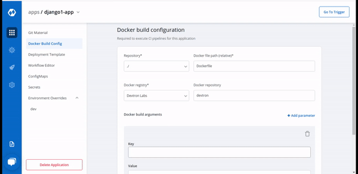

# Docker Build Configuration

In the previous step, we discussed git configurations. In this section, we will provide information on the docker build config.

Docker build configuration is used to create and push docker images in the docker registry of your application. You will provide all the docker related information to build and push docker images in this step.

Only one docker image can be created even for multi-git repository applications as explained in the [previous step](git-material.md).

Here, as you can see, there are 5 options to configure your **docker build**.

1. Repository
2. Docker file path
3. Docker Registry
4. Docker Repository
5. Docker build arguments
   * Key
   * Value

## Repository

In this field, you have to provide the checkout path of your repository. This repository is the same that you had defined earlier in git configuration details.

## Docker File Path

Here, you provide a relative path where your docker file is located. Ensure that the dockerfile is present on this path.

## Docker Registry

Select the docker registry that you wish to use. This registry will be used to [store docker images](../global-configurations/docker-registries.md).

## Docker Repository

In this field, add the name of your docker repository. The repository that you specify here will store a collection of related docker images. Whenever an image is added here, it will be stored with a new tag version.

## Key-value

This field will contain the key parameter and the value for the specified key for your [docker build](https://docs.docker.com/engine/reference/commandline/build/#options). This field is Optional. \(If required, this can be overridden at [CI step](../deploying-application/triggering-ci.md) later\)

