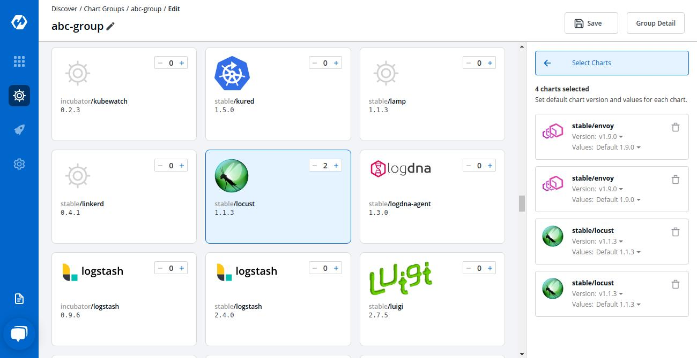
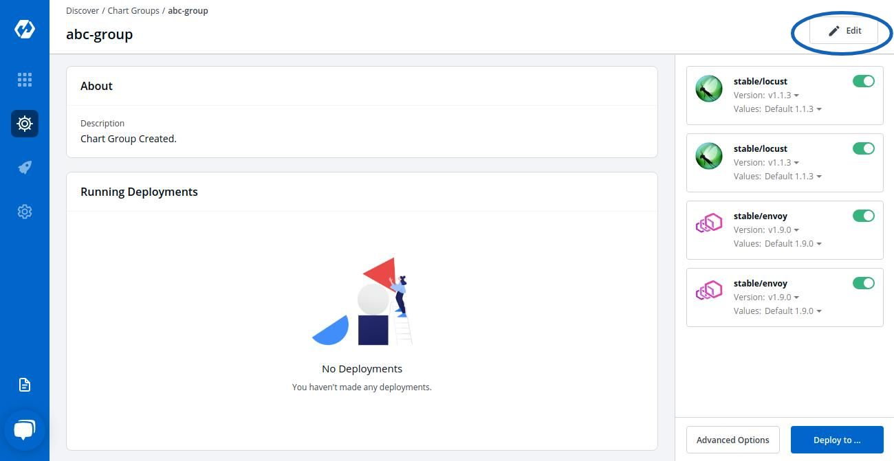
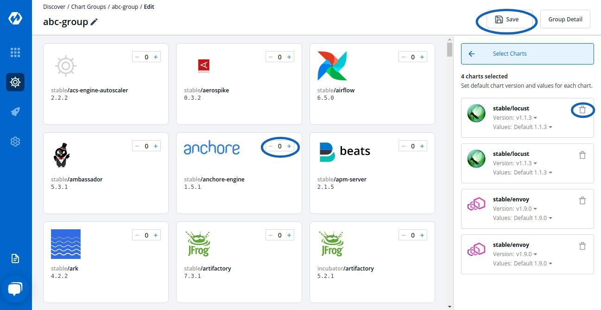
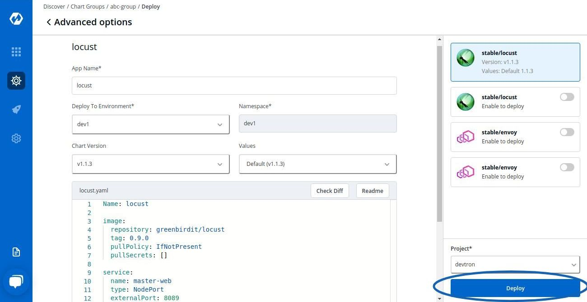

# Overview Of Charts

## Deploying Charts

Charts can be deployed individually or by creating a group of Charts.

Both methods are mentioned in the given document.

### Deploying Chart

Select Discover and then select the chart that you want to use

Click on README.MD to get more idea about the configurations of the chart

Select the Chart Version that you want to use and Chart Value, you can either use the default Values or custom values.

To know about Custom Values, Click On: [Custom Values](overview-of-charts.md#custom-values)

The configuration values can be edited in the section given below Chart Version.

| Key | Description |
| :--- | :--- |
| `App Name` | The name of the app |
| `Project` | Project of the app |
| `Environment` | Environment of the app to be deployed |
| `Chart Version` | Version of the chart to be used |

ReadMe.md present on the left can be used by the user to set configuration values

Click on `Deploy Chart` to deploy the chart

You can see the status of the chart deployed. Click on `Values.Yaml` to reconfigure the deployment.

Configuration values can be edited over here by the help of ReadMe.md

Select Update And Deploy to update new settings.

### Custom Values

You can use the default values or create Custom value by clicking on `Create Custom`

You can name your Custom Value, select the Chart Version and change the configurations in YAML file.

Click on `Save Template` to save the configurations.

### Deploying Chart Groups

To deploy multiple applications and work with them simulataneously, you can use `Chart Groups`.

To create Chart Groups Click on `Discover` and Click on `Create Group`

Add the Group Name and Description and Click on `Create Group`

You can select the Charts that you want to add in your Chart Group by clicking on '+' sign.

You can select a particular chart multiple number of times according to your requirements.

Select the `Version` and `Values` for your charts.

You can use Default Values or the Custom Values, just make sure the Value that you select for your Chart is comptabile with the Version of the Chart that you are using.

To edit the Chart Configuration, Click on 'Edit'

You can `Add` more Charts to your existing Chart Group or `Delete` Charts from your existing Chart Group.

After making changes, Click on `Save` to save changes to your Chart Group.

If you wish to edit the Chart Configuration, Double Click on that Chart and edit the Configurations in YAML File.

You can edit the `App Name`, `Chart Version`, `Values`, `Deploy Environment` and the YAML file.

| Key | Description |
| :--- | :--- |
| `App Name` | Name of the app |
| `Project` | Name of Project in which app has to be created |
| `Environment` | Name of the Environment in which app has to be deployed |
| `Chart Version` | Select the Version of the chart to be used |

Click on `Deploy` to initiate the deployment of a Chart in Chart Group.

